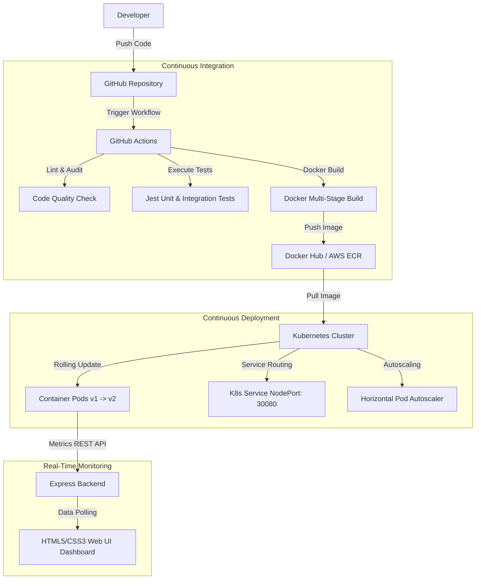

# Cloud-Native Automated DevOps CI/CD Pipeline Dashboard

An enterprise-grade, automated CI/CD deployment pipeline and real-time monitoring center for containerized web applications. This repository contains the complete infrastructure-as-code manifests, test suites, and configurations required to run and deploy the dashboard microservice across local environments (Docker Compose) and cloud clusters (AWS EKS, Azure AKS, Jenkins, and Azure DevOps).

---

## 🌐 Live Hosted Link
Access the live cloud instance deployed on AWS:
👉 **[http://34.224.213.234](http://34.224.213.234)**

---

## 🚀 Key Features

*   **Continuous Integration Gate**: Automates testing with Jest and Supertest. Static analysis and unit tests execute inside a multi-stage Docker build to reject broken builds before publication.
*   **Production-Optimized Containers**: Configures a lightweight Alpine-based runner under a non-privileged `node` user (UID 1000) for enhanced container security.
*   **Kubernetes Orchestration**: Features zero-downtime rolling update specifications (`maxSurge: 1`, `maxUnavailable: 0`), automated liveness/readiness health probes, and resource quota requests/limits.
*   **Auto-Healing & Scaling**: Implements a Horizontal Pod Autoscaler (HPA) targeting a 70% CPU threshold to dynamically scale pods between 2 and 8 replicas.
*   **Live Observability Panel**: Features a web console to trigger simulated builds, monitor live CPU/Memory utilization via Chart.js, inspect network traffic, and stream logs.

---

## 📊 System Architecture



---

## 📂 Repository Layout

```text
├── .github/
│   └── workflows/
│       └── ci-cd.yml          # GitHub Actions CI/CD Pipeline
├── k8s/
│   ├── deployment.yaml        # K8s Deployment Manifest (3 replicas, Probes)
│   ├── service.yaml           # K8s NodePort Service Manifest (Port 30080)
│   └── hpa.yaml               # Kubernetes Horizontal Pod Autoscaler
├── public/
│   ├── index.html             # Dashboard Frontend Structure
│   ├── style.css              # Custom Styling (HSL Theme)
│   ├── app.js                 # Dashboard Client Logic
│   └── chart.js               # Local Graphing Library (Offline Resilience)
├── tests/
│   └── app.test.js            # Express API Endpoint Unit Tests
├── .dockerignore              # Docker Build Exclusions
├── azure-pipelines.yml        # Azure DevOps Pipelines Configuration
├── Dockerfile                 # Multi-stage production-optimized Dockerfile
├── docker-compose.yml         # Local Container Orchestration Configuration
├── Jenkinsfile                # Declarative Jenkins CI/CD Pipeline
├── package.json               # Node Package configuration and scripts
└── server.js                  # Express API Server and CI/CD Simulator
```

---

## 🛠️ Getting Started Locally

### 1. Run via Node.js
Prerequisites: Node.js v20+
```bash
# Install dependencies
npm install

# Run unit tests
npm test

# Start the dashboard service
npm start
```
Access the server locally at `http://localhost:3000`.

### 2. Run via Docker Compose
Prerequisites: Docker Engine and Docker Compose
```bash
# Build and start the container
docker-compose up --build -d
```
Access the dashboard service at `http://localhost:3000`.

---

## ☁️ Deployment Pipeline Configurations

*   **GitHub Actions (`.github/workflows/ci-cd.yml`)**: Packages the container, authenticates with Amazon ECR, and triggers rolling updates to EKS.
*   **Jenkins (`Jenkinsfile`)**: Declarative multi-stage pipeline utilizing credentials helper for registry logins and rolling deploys.
*   **Azure DevOps (`azure-pipelines.yml`)**: Builds, publishes, and deploys artifacts to Azure Kubernetes Service (AKS).
