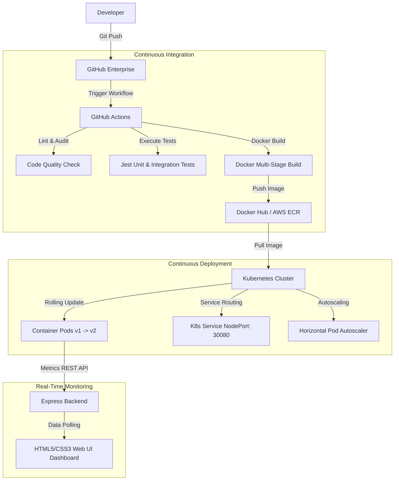

# Enterprise Cloud-Native DevOps CI/CD Pipeline & Observability Dashboard

[](https://github.com/vartexx/devops-cloud-cicd-pipeline/actions)
[](https://opensource.org/licenses/MIT)
[](https://hub.docker.com/)
[](https://kubernetes.io/)

An end-to-end, production-grade DevOps automation architecture and live cluster monitoring system. This repository contains the complete source code, testing configurations, Docker multi-stage layers, Kubernetes orchestration manifests, and multi-cloud CI/CD pipeline templates (GitHub Actions, Jenkins, and Azure DevOps) required to deploy and scale a containerized web dashboard across enterprise cloud infrastructures.

---

## 🌐 Live Cloud Deployment
The microservice is actively deployed on AWS and can be accessed publicly:
👉 **[http://34.224.213.234](http://34.224.213.234)**

---

## 📸 System Interface Preview

### 1. Observability Panel & Live Telemetry
Displays real-time system metrics, container statuses, and streams active logs from the simulated build pipeline.


### 2. Deployment Pipeline History
Lists persistent execution records, branch allocations, commit hashes, and durations.


---

## 📊 System Architecture & Engineering Workflow



---

## ⚙️ Technical Specifications & Rationale

### 1. Docker Multi-Stage Optimization (`Dockerfile`)
Our containerization strategy isolates build-time dependencies from the runtime footprint:
*   **Builder Stage**: Standardizes the compile-time environment using `node:20-alpine`, installs developer packages via `npm ci`, copies the source tree, and executes unit tests. If any tests fail, the build halts, preventing broken code from packaging.
*   **Runner Stage**: Copies only compiled assets, static public assets, and production dependencies (`npm ci --only=production`). The container is locked down to run as the non-root user `node` (UID 1000) rather than `root` to limit local privilege escalation vectors.
*   **Healthcheck**: Embeds a native engine healthcheck polling the `/healthz` probe every 30 seconds.

### 2. Kubernetes Orchestration (`/k8s`)
*   **Rolling Updates (`deployment.yaml`)**: Configured with `maxSurge: 1` and `maxUnavailable: 0`. This guarantees zero-downtime updates: a new pod is started and verified before any old pod is terminated.
*   **Self-Healing Probes**: Readiness and liveness probes point to `/healthz` on port 3000. Traffic is only routed to a pod once readiness checks pass, and unresponsive containers are automatically restarted.
*   **Autoscaler (`hpa.yaml`)**: Implements Horizontal Pod Autoscaling to automatically scale replicas between 2 and 8 based on a target CPU threshold of 70%.

---

## 🛠️ REST API Endpoints

The Express server exposes the following endpoints to serve telemetry and simulate pipelines:

*   **`GET /healthz`**: Used by Kubernetes probes and Docker engines to verify container status. Returns `200 OK`.
*   **`GET /api/metrics`**: Returns live CPU, Memory, Network traffic volume (Mbps), Active container replicas, and System Uptime.
*   **`GET /api/builds`**: Retrieves the deployment pipeline database history.
*   **`POST /api/trigger-build`**: Triggers a simulated, asynchronous multi-stage build pipeline, generating real-time logs and updating build statuses.

---

## 🚀 Getting Started Locally

### Prerequisites
*   Node.js v20+ or Docker Desktop

### 1. Local Node.js Development
```bash
# Clone the repository
git clone https://github.com/vartexx/devops-cloud-cicd-pipeline.git
cd devops-cloud-cicd-pipeline

# Install all dependencies (dev + production)
npm install

# Run Jest unit test suites
npm test

# Start the server locally
npm start
```
Open **`http://localhost:3000`** in your browser.

### 2. Local Container Orchestration (Docker Compose)
```bash
# Start the container stack in detached mode
docker-compose up --build -d

# Check running containers
docker ps

# View container console logs
docker logs devops_dashboard_container
```
Open **`http://localhost:3000`** in your browser.

---

## ☁️ Cloud Pipeline Integration Guides

This repository includes pre-configured workflows for the top industry standard CI/CD platforms:

### 1. GitHub Actions (`.github/workflows/ci-cd.yml`)
Runs linting and unit tests on every pull request. On push to `main`, it builds the Docker container, pushes it to your registry, connects to AWS, updates your Kubeconfig, and triggers a rolling rollout to your AWS EKS cluster.
*Required GitHub Repository Secrets:*
*   `AWS_ACCESS_KEY_ID` & `AWS_SECRET_ACCESS_KEY`
*   `DOCKERHUB_USERNAME` & `DOCKERHUB_TOKEN`

### 2. Jenkins Declarative Pipeline (`Jenkinsfile`)
Executes lint checks, unit tests, audits package security, compiles the image, authenticates using Jenkins Credential Helpers, and rolls out configurations to your Kubernetes cluster.
*Required Jenkins Credentials:*
*   `dockerhub-credentials-id` (Username/Password credentials)
*   `aws-kubeconfig-credentials-id` (Secret File containing Kubeconfig)

### 3. Azure DevOps (`azure-pipelines.yml`)
Multi-stage build pipeline that runs test assertions, packages the container, uploads it to Azure Container Registry (ACR), and deploys it to your Azure Kubernetes Service (AKS) cluster.
*Required Service Connections:*
*   `acr-service-connection`
*   `aks-service-connection`
